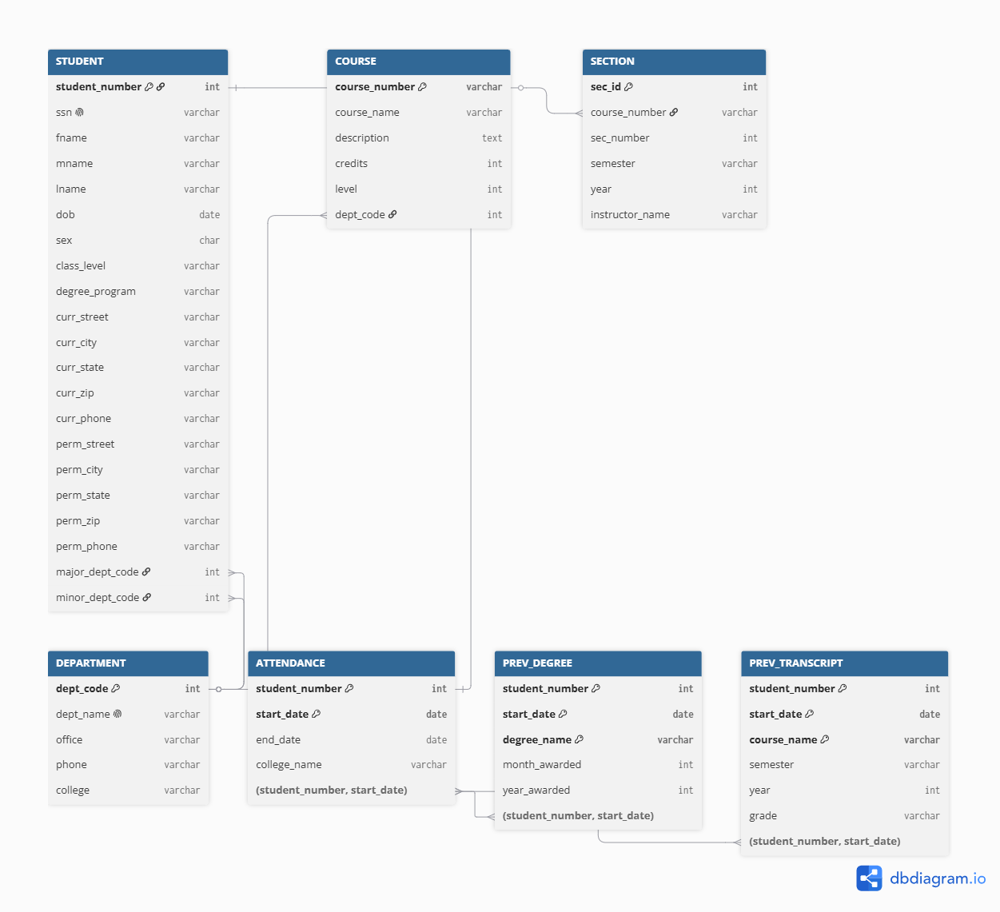

# Tài liệu Thiết kế CSDL (Database Design Documentation - DDD)

## 📌 Tổng quan dự án
- **Học phần:** Cơ sở dữ liệu
- **Bài thực hành:** Bài tập 3.16 & 3.31 (Mô hình CSDL University mở rộng)
- **Chuẩn đáp ứng:** Theo Thông báo 05 - Yêu cầu lập tài liệu thiết kế CSDL (DDD)

---

## 📄 1. Data Definition Language (DDL) Scripts
Toàn bộ mã nguồn SQL được phân chia lưu trữ trong thư mục [`schema/`](./schema/):
- [`01_initial_schema.sql`](./schema/01_initial_schema.sql): Khởi tạo lược đồ CSDL, tạo các bảng, định nghĩa khóa chính (PK) và khóa ngoại (FK).
- [`02_indexes_constraints.sql`](./schema/02_indexes_constraints.sql): Định nghĩa các chỉ mục (Index), ràng buộc duy nhất (Unique) và ràng buộc kiểm tra (Check Constraints).
- [`03_stored_procedures.sql`](./schema/03_stored_procedures.sql): Định nghĩa các thủ tục lưu trữ cho nghiệp vụ hệ thống.

---

## 🖼️ 2. Entity-Relationship Diagrams (ERD)
Sơ đồ ERD thể hiện mối quan hệ giữa các thực thể trong hệ thống:
- File mã nguồn sơ đồ: [`docs/schema_erd.dbml`](./docs/schema_erd.dbml)
- **Hình ảnh Sơ đồ ERD:**

---

## 📊 3. Table Descriptions (Mô tả chi tiết các Bảng)

| Bảng | Khóa chính (PK) | Khóa ngoại (FK) | Mục đích sử dụng |
| :--- | :--- | :--- | :--- |
| **`DEPARTMENT`** | `dept_code` | Không có | Quản lý danh mục các Khoa chuyên môn |
| **`STUDENT`** | `student_number` | `major_dept_code`, `minor_dept_code` | Hồ sơ sinh viên, địa chỉ hiện tại và thường trú |
| **`COURSE`** | `course_number` | `dept_code` | Danh mục môn học thuộc các Khoa phụ trách |
| **`SECTION`** | `sec_id` | `course_number` | Quản lý các lớp học phần mở trong kỳ |
| **`ATTENDANCE`** | `(student_number, start_date)` | `student_number` | **Thực thể yếu:** Quá trình học tập tại các trường cũ |
| **`PREV_DEGREE`** | `(student_number, start_date, degree_name)` | `(student_number, start_date)` | **Thực thể yếu:** Danh sách bằng cấp đã nhận từ trường cũ |
| **`PREV_TRANSCRIPT`** | `(student_number, start_date, course_name)` | `(student_number, start_date)` | **Thực thể yếu:** Bảng điểm các môn tích lũy tại trường cũ |

---

## ⚡ 4. Index Documentation (Tài liệu Chỉ mục)

| Tên Chỉ Mục | Bảng áp dụng | Cột được đánh chỉ mục | Mục đích tối ưu |
| :--- | :--- | :--- | :--- |
| `idx_student_ssn` | `STUDENT` | `ssn` | Tra cứu nhanh hồ sơ sinh viên qua số CCCD/SSN |
| `idx_student_perm_addr` | `STUDENT` | `perm_city`, `perm_state`, `perm_zip` | Phục vụ tìm kiếm theo địa chỉ thường trú (City, State, Zip) |
| `idx_section_term` | `SECTION` | `course_number`, `semester`, `year` | Tối ưu hiển thị danh sách lớp mở trong từng học kỳ |

---

## 🔒 5. Constraints Documentation (Tài liệu Ràng buộc)

1. **Unique Constraint (`uq_section_term`):** Đảm bảo tính duy nhất của bộ `(course_number, sec_number, semester, year)` trong bảng `SECTION`.
2. **Check Constraint (`chk_class_level`):** Giới hạn các giá trị của `class_level` thuộc tập: `Freshman`, `Sophomore`, `Junior`, `Senior`, `Graduate`.
3. **Foreign Key Restrict/Cascade:** Ngăn chặn việc xóa khoa nếu đang có sinh viên theo học, tự động cập nhật dây chuyền mã môn học nếu có thay đổi.

---

## 🛠️ 6. Stored Procedures & Functions Documentation

### Thủ tục: `getStudentPreviousEducation`
- **Mục đích:** Truy vấn đầy đủ lịch sử học tập tại trường cũ của một sinh viên (Gồm các trường đã học, bằng cấp nhận được và bảng điểm chi tiết).
- **Tham số vào:** `p_student_number INT` (Mã số sinh viên).
- **Mã triển khai:** Xem chi tiết tại [`schema/03_stored_procedures.sql`](./schema/03_stored_procedures.sql).

---

## 🔄 7. Version Control & Updates Strategy
- Quản lý phiên bản mã nguồn trên GitHub repository.
- Mọi thay đổi về cấu trúc bảng (Schema changes) bắt buộc được thực thi bằng file script nâng phiên bản (`V1.x`).