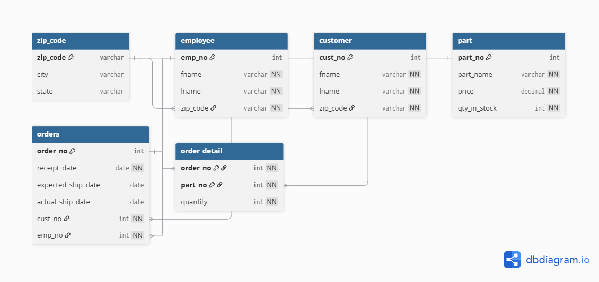

# Tài liệu Thiết kế CSDL (Database Design Documentation - DDD)

## 📌 Tổng quan dự án
- **Học phần:** Cơ sở dữ liệu
- **Bài thực hành:** Bài tập 3.32 (Mô hình CSDL Mail Order)
- **Chuẩn đáp ứng:** Theo Thông báo 05 - Yêu cầu lập tài liệu thiết kế CSDL (DDD)

---

## 📄 1. Data Definition Language (DDL) Scripts
Toàn bộ mã nguồn SQL được phân chia lưu trữ trong thư mục [`schema/`](./schema/):
- [`01_initial_schema.sql`](./schema/01_initial_schema.sql): Khởi tạo lược đồ CSDL, tạo các bảng (`ZIP_CODE`, `EMPLOYEE`, `CUSTOMER`, `PART`, `ORDERS`, `ORDER_DETAIL`), định nghĩa khóa chính (PK) và khóa ngoại (FK).
- [`02_indexes_constraints.sql`](./schema/02_indexes_constraints.sql): Định nghĩa các chỉ mục (Index) và ràng buộc kiểm tra (Check Constraints).
- [`03_stored_procedures.sql`](./schema/03_stored_procedures.sql): Định nghĩa thủ tục lưu trữ xử lý nghiệp vụ xuất hóa đơn đơn hàng.

---

## 🖼️ 2. Entity-Relationship Diagrams (ERD)
Sơ đồ ERD thể hiện mối quan hệ giữa các thực thể trong hệ thống:
- File mã nguồn sơ đồ: [`docs/schema_erd.dbml`](./docs/schema_erd.dbml)
- **Hình ảnh Sơ đồ ERD:**

---

## 📊 3. Table Descriptions (Mô tả chi tiết các Bảng)

| Bảng | Khóa chính (PK) | Khóa ngoại (FK) | Mục đích sử dụng |
| :--- | :--- | :--- | :--- |
| **`ZIP_CODE`** | `zip_code` | Không có | Quản lý danh mục mã vùng bưu chính (Zip Code) |
| **`EMPLOYEE`** | `emp_no` | `zip_code` | Thông tin nhân viên tiếp nhận và xử lý đơn hàng |
| **`CUSTOMER`** | `cust_no` | `zip_code` | Hồ sơ khách hàng mua hàng |
| **`PART`** | `part_no` | Không có | Danh mục linh kiện/sản phẩm, đơn giá và số lượng tồn kho |
| **`ORDERS`** | `order_no` | `cust_no`, `emp_no` | Quản lý thông tin đơn hàng, ngày nhận và ngày giao dự kiến/thực tế |
| **`ORDER_DETAIL`** | `(order_no, part_no)` | `order_no`, `part_no` | **Thực thể yếu / Bảng trung gian:** Chi tiết các mặt hàng và số lượng mua trong từng đơn |

---

## ⚡ 4. Index Documentation (Tài liệu Chỉ mục)

| Tên Chỉ Mục | Bảng áp dụng | Cột được đánh chỉ mục | Mục đích tối ưu |
| :--- | :--- | :--- | :--- |
| `idx_orders_customer` | `ORDERS` | `cust_no` | Tối ưu tra cứu lịch sử mua hàng của một khách hàng |
| `idx_orders_employee` | `ORDERS` | `emp_no` | Tối ưu thống kê số lượng đơn hàng do nhân viên xử lý |
| `idx_part_name` | `PART` | `part_name` | Tăng tốc tìm kiếm linh kiện và kiểm tra tồn kho theo tên |

---

## 🔒 5. Constraints Documentation (Tài liệu Ràng buộc)

1. **Check Constraint (`chk_ship_dates`):** Đảm bảo ngày giao hàng thực tế (`actual_ship_date`) không được nhỏ hơn ngày tiếp nhận đơn hàng (`receipt_date`).
2. **Check Constraint (`quantity > 0`):** Giới hạn số lượng mặt hàng đặt mua trong chi tiết đơn hàng phải lớn hơn 0.
3. **Foreign Key Restrict/Cascade:** Ngăn chặn xóa thông tin khách hàng/nhân viên nếu đang có đơn hàng liên quan; tự động xóa chi tiết đơn hàng nếu đơn hàng mẹ bị xóa.

---

## 🛠️ 6. Stored Procedures & Functions Documentation

### Thủ tục: `getOrderInvoice`
- **Mục đích:** Truy vấn xuất hóa đơn chi tiết của một đơn hàng (Bao gồm thông tin đơn hàng, khách hàng, nhân viên tiếp nhận, danh sách từng sản phẩm, số lượng, đơn giá và tổng thành tiền).
- **Tham số vào:** `p_order_no INT` (Mã số đơn hàng).
- **Mã triển khai:** Xem chi tiết tại [`schema/03_stored_procedures.sql`](./schema/03_stored_procedures.sql).

---

## 🔄 7. Version Control & Updates Strategy
- Quản lý phiên bản mã nguồn trên GitHub repository.
- Mọi thay đổi về cấu trúc bảng (Schema changes) bắt buộc được thực thi bằng file script nâng phiên bản (`V1.x`).